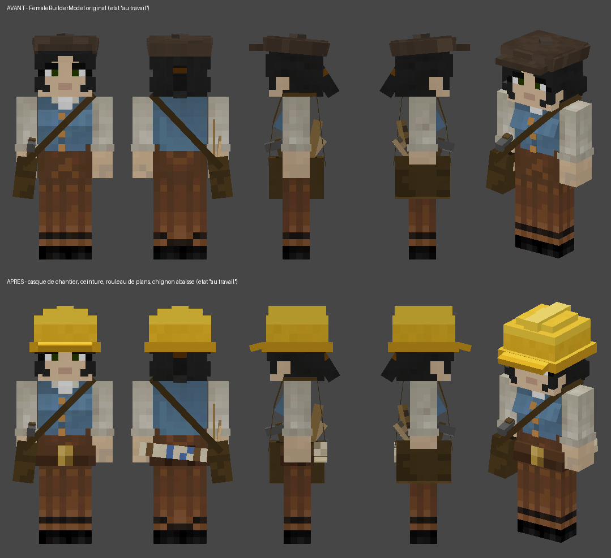
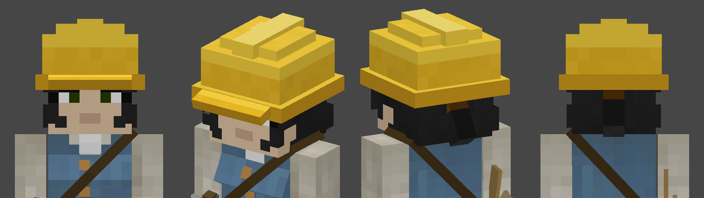
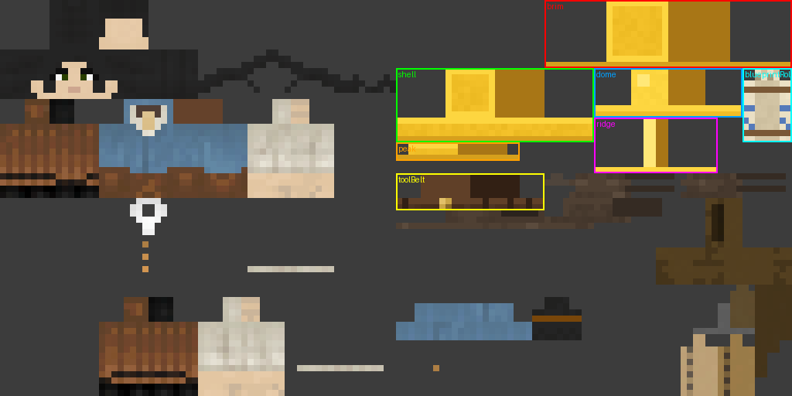
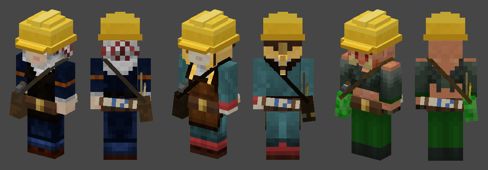

# Modification du modèle 3D de la buildeuse (female builder)

Ce dépôt est une copie 1:1 de
[ldtteam/minecolonies @ `v1.21.1-1.1.1399-snapshot`](https://github.com/ldtteam/minecolonies/tree/v1.21.1-1.1.1399-snapshot)
(commit `01af981f19f306a777fdfafb17d64d94db7ab4b2`), importée telle quelle dans un
premier commit, puis modifiée dans un second commit pour changer le modèle 3D de la
**buildeuse** (citoyenne qui exerce le métier de builder).



## 1. Ce qui a changé (résumé)

Quand la buildeuse **travaille** (`render metadata` contenant `working`) :

| Élément | Avant | Après |
|---|---|---|
| Couvre-chef | casquette plate brune (`Cap` : 7 cubes) | **casque de chantier jaune** (`HardHat` : coque, dôme, arête centrale, rebord, visière = 5 cubes) |
| Taille | — | **ceinture à outils** en cuir avec boucle en laiton (`toolBelt`) |
| Dos | — | **rouleau de plans** (papier beige, ficelles, traits bleus) coincé derrière la ceinture (`blueprintRoll`) |
| Chignon | au milieu de l'arrière de la tête | **abaissé sur la nuque** pendant que le casque est porté (sinon il traverserait la coque) |
| Sac, marteau, règles, sangles | inchangés | inchangés |

Quand elle **ne travaille pas** (au repos, dort, porte un casque d'armure, texture custom…) : rien
ne change, le rendu est identique pixel pour pixel à l'original (vérifié avec l'outil de rendu,
voir §5).



## 2. Où c'est — fichiers touchés

### Modifiés

| Fichier | Rôle |
|---|---|
| `src/main/java/com/minecolonies/core/client/model/FemaleBuilderModel.java` | **le modèle 3D** (export Blockbench en Java : liste de cubes + hiérarchie + `setupAnim`) |
| `src/main/resources/assets/minecolonies/textures/entity/citizen/<style>/builderfemale1_{a,b,d,w}.png` | les **32 textures** (8 styles `default, eastasian, hellenic, medieval, modern, nether, nordic, undead` × 4 teints de peau `_a _b _d _w`) : pixels ajoutés pour les nouvelles pièces |

### Ajoutés

| Fichier | Rôle |
|---|---|
| `tools/female_builder/paint_female_builder_textures.py` | script qui peint les nouvelles zones UV dans les 32 textures (idempotent) |
| `tools/model_preview/render_citizen_model.py` | mini moteur de rendu Python des modèles citoyens (parse le `.java`, applique la texture) — utilisé pour vérifier le résultat sans lancer Minecraft |
| `documentation/female_builder_rework/*.png` | rendus avant/après, gros plan, autres styles, layout UV |
| `MODIFICATIONS_BUILDEUSE.md` | ce document |

Rien d'autre n'a été touché : l'enregistrement du modèle
(`ClientRegistryHandler.FEMALE_BUILDER` → `FemaleBuilderModel::createMesh`, et
`ModModelTypeInitializer` → `ModModelTypes.BUILDER`) est inchangé, car la classe garde le même
nom, le même constructeur et la même taille de texture (128×64). Le modèle masculin
(`MaleBuilderModel.java`) n'est pas modifié.

## 3. Détail du modèle 3D (`FemaleBuilderModel.java`)

Rappels sur le système de Minecraft : chaque pièce (`PartDefinition`) a un pivot (`PartPose`),
une rotation (ordre Z‑Y‑X) et des cubes (`addBox(x, y, z, largeur, hauteur, profondeur, CubeDeformation)`).
L'unité est le 1/16 de bloc, **Y pointe vers le bas** dans l'espace du modèle (la tête va de
y = ‑8 (sommet) à 0 (cou), le corps de 0 à 12, les jambes de 12 à 24) et **‑Z est devant** (le visage).
La `CubeDeformation` gonfle le cube de la valeur donnée sur chaque face ; c'est ce qui permet de
superposer des couches sans « z‑fighting » (peau 0 → cheveux 0.5 → coque du casque 0.6, etc.).

### 3.1 Supprimé : le groupe `Cap`

`Cap` (pivot `(0, -7.6, 0.1)`, incliné de ‑5°) et ses 7 cubes `center`, `tip`, `sideFront`,
`sideLeft`, `sideRight`, `sideBack`, `visor` ont été retirés. Leurs pixels de texture
(zone `(64..128, 28..37)`) ne sont plus utilisés, sauf le rectangle `(64,28)-(88,34)` réutilisé par
la ceinture.

### 3.2 Ajouté : le groupe `HardHat` (enfant de `head`)

Pivot `(0, -8, 0)` = centre du sommet du crâne, sans rotation. Coordonnées relatives à ce pivot :

| Cube | `texOffs` | `addBox` (x, y, z, l, h, p) | déform. | Rôle / étendue réelle (espace tête) |
|---|---|---|---|---|
| `shell` | `(64, 11)` | `(-4, -1, -4, 8, 4, 8)` | `0.6` | coque principale : ±4.6 en x/z, y de ‑9.6 à ‑4.4 (0.1 au‑dessus de la couche cheveux qui est à ±4.5) |
| `dome` | `(96, 11)` | `(-3, -2.3, -3, 6, 2, 6)` | `0.3` | dôme plus étroit posé sur la coque, sommet à y = ‑10.6 |
| `ridge` | `(96, 19)` | `(-1, -2.8, -4, 2, 1, 8)` | `0.25` | arête de renfort avant→arrière, sommet à y = ‑11.05, sa base (‑9.55) pénètre la coque (‑9.6) pour éviter deux faces coplanaires |
| `brim` | `(88, 0)` | `(-5, 2.5, -5, 10, 1, 10)` | `0.25` | rebord tout autour : ±5.25, y de ‑5.75 à ‑4.25 ; le bas de la coque (‑4.4) est caché dedans ; le bas du rebord s'arrête juste au‑dessus des yeux (y = ‑4) |
| `peak` | `(64, 23)` | `(-4, -0.5, -2, 8, 1, 2)` | `0` | visière avant, pivot `(0, 2.75, -5)`, rotation X = `0.2618` (15° vers le bas), sa racine est noyée dans le rebord |

### 3.3 Ajouté dans le groupe `toolbag` (enfant de `body`, visible seulement au travail)

| Cube | `texOffs` | `addBox` | déform. | Pivot / rotation | Rôle |
|---|---|---|---|---|---|
| `toolBelt` | `(64, 28)` | `(-4, 10, -2, 8, 2, 4)` | `0.5` | `(0, 0, 0)` | ceinture : ±4.5 / ±2.5, y de 9.5 à 12.5, soit 0.25 au‑dessus de la veste (couche 0.25) ; le haut des jambes (11.75) est caché dedans |
| `blueprintRoll` | `(120, 11)` | `(-1, -5, -1, 2, 10, 2)` | `0` | `(1.0, 10.5, 3.4)`, rot Z = `1.4708` rad (≈ 84°) | rouleau 2×10×2 défini vertical puis couché : il va de x ≈ ‑4 (caché derrière le sac) à x ≈ +6 (dépasse à gauche), z de 2.4 à 4.4 (derrière la ceinture dont la face arrière est à 2.5) |

### 3.4 Chignon (`hairback2_r1`) et `setupAnim`

```java
final boolean working   = isWorking(entity);
final boolean hardHatOn = working && displayHat(entity);

body.getChild("toolbag").visible = working;
head.getChild(HARD_HAT).visible  = hardHatOn;                       // était : head.getChild("Cap")
head.getChild(HAIR_BUN).y = hardHatOn ? HAIR_BUN_LOW_Y : HAIR_BUN_DEFAULT_Y;  // -2.7F : -4.9F
```

`displayHat()` (classe mère `CitizenModel`) est déjà `false` quand la citoyenne dort, porte un
casque d'armure ou utilise une texture personnalisée : dans tous ces cas le casque disparaît et le
chignon reprend sa place d'origine. Le pivot Y du chignon est **réaffecté à chaque frame**, donc
aucun état ne « fuit » entre deux citoyennes rendues avec la même instance de modèle.

Pourquoi abaisser le chignon ? Dans l'original il occupe y ∈ [‑6.9, ‑2.9] à l'arrière du crâne, en
plein dans la coque (qui descend à ‑4.4). Avec le pivot à ‑2.7 son sommet (≈ ‑4.44 à ‑4.83 selon
l'inclinaison de 7.5°) est caché dans le rebord (‑5.75 → ‑4.25) et le chignon ressort proprement
sous le casque, queue de cheval comprise.

## 4. Textures

Les 32 PNG font 128×64. La moitié gauche (64×64) est la peau humanoïde standard ; la moitié droite
contient les pièces supplémentaires. J'ai d'abord calculé, sur les 32 fichiers à la fois, les zones
**entièrement transparentes partout** (voir le script), puis j'y ai placé les rectangles UV des
nouveaux cubes (format Minecraft : largeur = 2·p + 2·l, hauteur = p + h) :

| Pièce | rectangle occupé | contenu peint |
|---|---|---|
| `brim` | `(88, 0)-(128, 11)` | jaune, dessus bordé plus clair, dessous sombre |
| `shell` | `(64, 11)-(96, 23)` | jaune, rangée haute claire, rangée basse plus foncée |
| `dome` | `(96, 11)-(120, 19)` | jaune clair + reflet |
| `ridge` | `(96, 19)-(116, 28)` | jaune très clair |
| `peak` | `(64, 23)-(84, 26)` | jaune, arête avant claire |
| `blueprintRoll` | `(120, 11)-(128, 23)` | papier beige, 2 ficelles brunes, traits bleus, bouts « en spirale » |
| `toolBelt` | `(64, 28)-(88, 34)` *(ancienne zone de la casquette)* | cuir brun, boucle laiton 2×2 au centre de la face avant, passants sombres |



Le script `tools/female_builder/paint_female_builder_textures.py` efface puis repeint uniquement
ces rectangles (même résultat à chaque exécution, graine aléatoire fixe pour le léger grain).
Vérification faite : sur les 32 textures, **0 pixel modifié en dehors de ces rectangles**.
Le casque est volontairement identique pour tous les styles (comme l'était la casquette).



## 5. Comment j'ai procédé

1. **Copie du dépôt** : téléchargement de l'archive du tag via `codeload.github.com`, extraction à la
   racine, commit d'import. `gradle.properties` et `lang/manual_en_us.json` sont listés dans le
   `.gitignore` upstream mais y sont pourtant suivis : ils ont été ajoutés avec `git add -f` pour
   que la copie soit complète (22 419 fichiers, ~148 Mo).
2. **Repérage** : `grep -rn FemaleBuilderModel` → la classe, son enregistrement
   (`ClientRegistryHandler`, `ModModelTypeInitializer`), la classe mère `CitizenModel`
   (`isWorking` / `displayHat`), la règle de nommage des textures
   (`ISimpleModelType.getTexture` → `builderfemale1` + suffixe de teint).
3. **Outil de rendu** (`tools/model_preview/render_citizen_model.py`) : parse `createMesh()`,
   reconstruit la hiérarchie, applique les mêmes conventions que `ModelPart.Cube` (layout UV des 6
   faces, déformation, miroir, rotation Z‑Y‑X, flip du renderer) et rasterise des vues
   orthographiques texturées. Il m'a servi à itérer sur les proportions et à prouver que l'état
   « au repos » est inchangé.
4. **Conception** du casque / ceinture / rouleau en calculant les étendues réelles de chaque cube
   (voir §3) pour éviter les faces coplanaires et les intersections visibles.
5. **Textures** : script de peinture déterministe appliqué aux 32 fichiers + contrôle de
   non‑régression hors zones.
6. **Compilation** : Gradle n'est pas utilisable dans l'environnement (dépôts Maven NeoForge
   inaccessibles), j'ai donc compilé `FemaleBuilderModel.java` avec le compilateur Eclipse (ECJ)
   contre des stubs reprenant exactement les signatures utilisées (`PartDefinition`,
   `CubeListBuilder`, `PartPose`, `ModelPart.y / .visible`, `CitizenModel`…) : compilation OK,
   et le même montage détecte bien une erreur introduite volontairement.

## 6. Rejouer / vérifier soi‑même

```bash
pip install pillow numpy

# rendu "au travail" (le chignon est abaissé comme le fait setupAnim en jeu)
python3 tools/model_preview/render_citizen_model.py \
  --java src/main/java/com/minecolonies/core/client/model/FemaleBuilderModel.java \
  --texture src/main/resources/assets/minecolonies/textures/entity/citizen/default/builderfemale1_a.png \
  --out /tmp/buildeuse.png --views front,back,left,right,iso --pivot hairback2_r1=0.1,-2.7,5.9 --check

# rendu "au repos"
python3 tools/model_preview/render_citizen_model.py ... --hide toolbag,HardHat

# repeindre les textures (après un changement de palette ou d'UV dans le script)
python3 tools/female_builder/paint_female_builder_textures.py
```

En jeu : `./gradlew runClient`, créer une colonie, embaucher une buildeuse et lui donner du travail
(le casque et l'équipement n'apparaissent que pendant qu'elle travaille).

## 7. Ajuster

* Hauteur du casque : pivot du groupe `HardHat` (`PartPose.offset(0, -8, 0)`), par pas de 0.25.
* Casque plus / moins volumineux : déformation de `shell` (0.6) et de `dome` (0.3).
* Position du chignon sous le casque : `HAIR_BUN_LOW_Y` (‑2.7).
* Longueur / inclinaison du rouleau : `addBox(... 10 ...)` et la rotation Z `1.4708` de `blueprintRoll`.
* Couleurs : palette en tête de `paint_female_builder_textures.py`, puis relancer le script.

## 8. Limites

* Pas de test en jeu dans cet environnement (pas de build Gradle possible) : la validation repose
  sur la compilation ECJ + stubs et sur le rendu Python, qui reproduit la géométrie et les UV
  mais pas l'éclairage ni les animations de Minecraft.
* Les icônes 16×16 `textures/entity_icon/citizen/*/builderfemale1_*.png` (générées par datagen,
  visage uniquement) n'ont pas besoin d'être régénérées.
