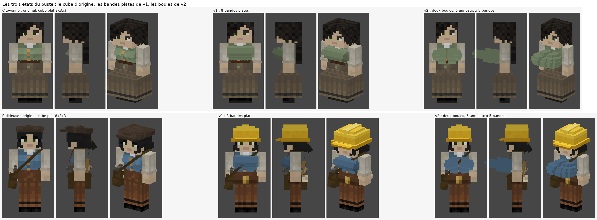
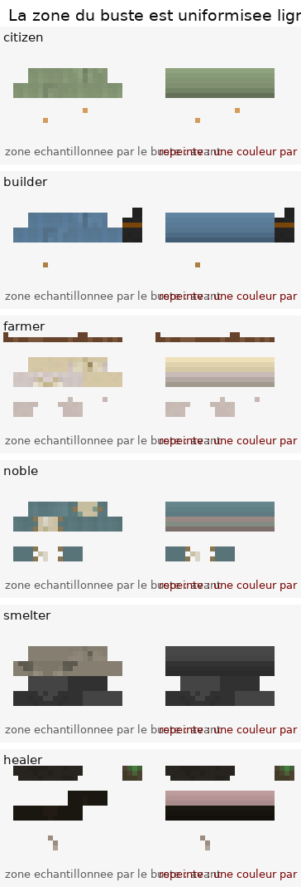
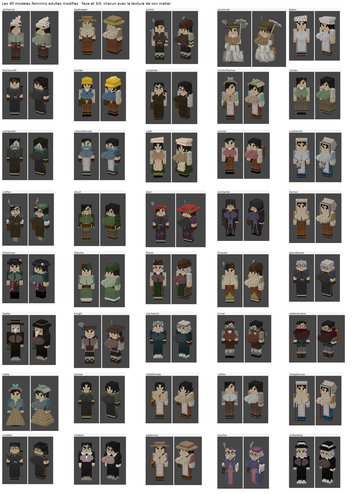

# Buste des modèles féminins — plus rond, plus grand, textures repeintes

> Deuxième modification « troll » du fork. Premier essai : le cube de poitrine était
> simplement **gonflé** (`CubeDeformation`) — ça marchait, mais ça faisait une planche
> plate, avec une couture et des pixels parasites. Cette version reconstruit le buste en
> **huit bandes** (deux lobes de quatre bandes) et **repeint la zone de texture** du buste
> sur les 1 720 textures féminines, pour un rendu rond, sans bug visuel, et un peu plus
> grand qu'avant.


---

## 1. Résumé

| | |
|---|---|
| **Ce qui a changé** | La pièce `"breast"` des 40 modèles féminins adultes n'est plus un cube 8×3×3 gonflé : c'est un empilement de 8 bandes fines (4 par côté, un sillon au milieu) et la zone de texture qu'elles échantillonnent est repeinte proprement. |
| **Taille** | Le buste dépasse le torse de **3,5 px** (au lieu de 1,5 px dans MineColonies et de 2,8 px au premier essai), sans toucher le cou. |
| **Forme** | Ronde : l'inclinaison passe de −30° à **−25°**, chaque bande est plus ou moins enfoncée, et le haut/milieu/bas sont de plus en plus foncés → le volume se lit. |
| **Textures** | `textures/entity/citizen/<style>/*female*.png` : le rectangle 22×6 px échantillonné par le buste est uniformisé **une couleur par ligne**, dérivée des couleurs du fichier → aucune couture possible entre les bandes. |
| **Bug corrigé au passage** | Le second cube (la « couche vêtement », 0,25 plus épaisse) dessinait une coquille par-dessus la poitrine et affichait des pixels isolés (par ex. un point orange sur la poitrine de la citoyenne). Il est supprimé, son contenu est recombiné dans la première couche. |
| **Le réglage** | Une ligne : `BREAST_DEFORMATION` dans `CitizenModel.java`. |
| **Non touché** | `FemaleChildModel`, les modèles masculins, les pillards, tous les autres pixels des textures, toutes les animations. |

Les trois états, pour situer le changement :



À gauche l'original de MineColonies, au milieu le premier essai (cube étiré — on voit la
bande plate, la lèvre de la coquille de tissu et un pixel orange égaré), à droite la
version actuelle.

---

## 2. Où changer quoi (3 endroits)

### 2.1 Le réglage de la taille — `CitizenModel.java`

`src/main/java/com/minecolonies/api/client/render/modeltype/CitizenModel.java` :

```java
public static final CubeDeformation BREAST_DEFORMATION = new CubeDeformation(0.35F, 0.6F, 1.25F);
```

Les 8 bandes de tous les modèles utilisent cette constante : changer ces trois nombres
change la poitrine des 40 métiers d'un coup.

| `BREAST_DEFORMATION` | Dépasse le torse de | Marge sous le cou | Largeur | Hauteur (vue de profil) |
|---|---|---|---|---|
| `new CubeDeformation(0.0F)` | 2,1 px | 2,1 px | 8,3 px | 5,5 px |
| `(0.2F, 0.3F, 0.6F)` | 2,7 px | 1,6 px | 8,7 px | 6,5 px |
| **`(0.35F, 0.6F, 1.25F)`** — retenu | **3,5 px** | **1,0 px** | **9,0 px** | **7,6 px** |
| `(0.5F, 0.8F, 1.7F)` | 4,0 px | 0,6 px | 9,3 px | 8,3 px |
| pour rappel : le cube d'origine | 1,5 px | 1,4 px | 8,5 px | 4,8 px |

Mesures faites sur le rendu (1 unité = 1 px de texture = 1/16 de bloc) ; « marge sous le
cou » = distance entre le point le plus haut du buste et la ligne du cou (y = 0 dans le
repère du corps) — à ne pas laisser descendre à 0. L'axe **x** reste petit sinon le buste
mange les bras ; les axes **y** et **z** sont ceux qui font la saillie, à cause de
l'inclinaison.


Pour revenir à un buste normal pour **un seul** métier, on remet
`new CubeDeformation(0.0F)` dans le `addBox` de ce fichier (ou on supprime la ligne
`breast` du modèle : la poitrine disparaît alors complètement, comme sur les hommes).

### 2.2 La forme — les 40 `Female*Model.java`

`src/main/java/com/minecolonies/core/client/model/`. Avant ce commit, l'instruction était ; dans le MineColonies d'origine,
`new CubeDeformation(0.0F)` et `new CubeDeformation(0.25F)` y tiennent lieu de constantes :

```java
PartDefinition breast = bipedBody.addOrReplaceChild("breast", CubeListBuilder.create()
    .texOffs(64, 49).addBox(-3.0F, 1.8938F, -5.716F, 8.0F, 3.0F, 3.0F, BREAST_DEFORMATION)
    .texOffs(64, 55).addBox(-3.0F, 1.8938F, -5.716F, 8.0F, 3.0F, 3.0F, BREAST_OVERLAY_DEFORMATION),
    PartPose.offsetAndRotation(-1.0F, 3.0F, 4.0F, -0.5236F, 0.0F, 0.0F));
```

et, après cette modification, le même passage et maintenant (extrait de `FemaleCitizenModel.java`) :

```java
PartDefinition breast = bipedBody.addOrReplaceChild("breast", CubeListBuilder.create()
  .texOffs(64, 49).addBox(-2.65F, 1.3688F, -5.116F, 3.4F, 1.05F, 2.0F, BREAST_DEFORMATION)
  .texOffs(64, 49).addBox( 1.25F, 1.3688F, -5.116F, 3.4F, 1.05F, 2.0F, BREAST_DEFORMATION)
  .texOffs(64, 49).addBox(-3.1F,  2.4188F, -6.216F, 3.8F, 1.05F, 3.0F, BREAST_DEFORMATION)
  .texOffs(64, 49).addBox( 1.3F,  2.4188F, -6.216F, 3.8F, 1.05F, 3.0F, BREAST_DEFORMATION)
  .texOffs(64, 49).addBox(-3.15F, 3.4688F, -7.116F, 3.8F, 1.05F, 4.0F, BREAST_DEFORMATION)
  .texOffs(64, 49).addBox( 1.35F, 3.4688F, -7.116F, 3.8F, 1.05F, 4.0F, BREAST_DEFORMATION)
  .texOffs(64, 49).addBox(-2.4F, 4.5188F, -5.916F, 3.0F, 1.05F, 5.0F, BREAST_DEFORMATION)
  .texOffs(64, 49).addBox( 1.4F,  4.5188F, -5.916F, 3.0F, 1.05F, 5.0F, BREAST_DEFORMATION),
  PartPose.offsetAndRotation(-1.0F, 3.0F, 4.0F, -0.4363F, 0.0F, 0.0F));
```

Comment lire ces nombres :

* **4 bandes par côté, 1,05 px de haut, espacées de 1 px** — elles se recouvrent donc de
  0,05 px, ce qui est volontaire : deux faces strictement coplanaires de deux bandes
  voisines se mettraient à clignoter (z-fighting), notamment dans le sillon. L'ensemble
  mesure 4,05 px au lieu des 3 px du cube d'origine (0,5 px de plus en haut et en bas) :
  c'est ce qui donne la hauteur du buste, et la marge sous le cou reste de 1,0 px.
* **largeur 3,4 / 3,8 / 3,8 / 3,0** — les bandes du haut et du bas sont plus étroites,
  donc la silhouette vue de face est ovale et non rectangulaire.
* **le `z`** (`-5.116`, `-6.216`, `-7.116`, `-5.916`) — c'est la saillie de chaque bande.
  La 3ᵉ bande est la plus en avant, les deux extrêmes sont reculées : la tranche visible
  de chaque bande est une face horizontale, que Minecraft éclaire différemment de la face
  avant → c'est ça qui donne le rond, sans dépendre de la texture.
* **le `depth` (2, 3, 4, 5)** — sert aussi à choisir la couleur : une face avant échantillonne
  la ligne `49 + depth` de la texture, donc chaque bande prend la nuance prévue pour sa
  hauteur (voir § 2.3).
* **deux lobes séparés de 0,5 à 0,8 px** — le sillon est réel (géométrique), pas dessiné :
  les deux faces intérieures sont des faces latérales, donc naturellement plus sombres.
  L'écart augmente bande par bande, là encore pour éviter deux faces coplanaires.
* **`PartPose.offsetAndRotation(..., -0.4363F, ...)`** — l'inclinaison passe de −30°
  (-0.5236) à −25° : le buste pointe moins vers le haut, ce qui arrondit la vue de profil
  et rend ~1 px de marge sous le cou, réinvestis dans la taille.

Tous les modèles gardent la géométrie de *leur* corps : le script qui a écrit ces lignes
relit l'ancienne valeur de chaque fichier (c'est nécessaire pour `FemaleCourierModel`,
dont le cube est à `y = 2.2938F` avec un pivot à `-9.0F`, et pour `FemaleAlchemistModel`
dont l'instruction était déjà écrite sur trois lignes). `FemaleNobleModle` porte la faute de
frappe d'origine (`Modle`), conservée.

### 2.3 Les textures — `tools/female_bust/paint_textures.py`

Le rectangle échantillonné par le buste est `x 64..85, y 49..54` (22×6 px sur les textures
128×64, 44×12 sur les 256×128 de certains styles) : lignes 49-51 pour les faces vers le
haut/bas, lignes 52-54 pour les quatre faces latérales dont la face avant `x 67..74`.

Sur **les 1 720 textures féminines** des 8 styles (`default`, `modern`, `medieval`,
`hellenic`, `eastasian`, `nordic`, `nether`, `undead`), pour chaque fichier :

1. le contenu de l'ancienne couche « vêtement » (`y 55..60`) est **recombiné** dans le
   rectangle, quand il est réellement peint (540 fichiers sur 1 720 : tabliers, gilets,
   plastrons) — c'est lui qui donnait la couleur visible sur la poitrine ;
2. chaque ligne du rectangle est remplacée par **la couleur médiane** de ce que le fichier
   y avait déjà (sur la fenêtre de la face avant), étalée sur toute la largeur ;
3. une rampe douce est appliquée par-dessus : lignes 49→54 multipliées par
   `1,06 / 1,03 / 1,00 / 1,00 / 0,95 / 0,88`.

Résultat : le vêtement/skin de chaque métier et de chaque couleur de peau est conservé
(puisqu'il est *calculé depuis le fichier*), mais il n'y a plus ni trame de dithering
étirée, ni détail déformé, et surtout **chaque bande du buste tombe sur une ligne
différente de la même rampe** → les marches de l'escalier se fondent au lieu de se voir.



Les fichiers en mode palette (`P`, 692 d'entre eux) sont écrits en `RGBA`, leur palette ne
contenant pas les nuances de la rampe. Minecraft charge les deux de la même façon.

---

## 3. Outils ajoutés (`tools/female_bust/`)

| Script | Rôle |
|---|---|
| `rework_bust.py` | Réécrit l'instruction `"breast"` des 40 modèles à partir du tableau `BANDS` (largeur, profondeur, enfoncement) et de `CLEAVAGE`/`TILT`. C'est là qu'on change la **forme**. `--check-only` affiche la géométrie lue dans chaque fichier. |
| `bust_paint.py` + `paint_textures.py` | Les couleurs et la rampe décrites au § 2.3, et l'application aux textures (`--only default`, `--dry-run`). C'est là qu'on change l'**ombrage**. |
| `proto.py` | Atelier de conception : rend plusieurs géométries candidates côte à côte et mesure `top_y` / saillie / largeur / hauteur. `python3 tools/female_bust/proto.py --scale 22`. |
| `render_compare.py`, `make_docs.py` | Rendus de comparaison (avant depuis une révision git, après depuis l'arbre de travail) et régénération des PNG de ce dossier. |

Pour tout refaire de zéro après avoir changé un paramètre :

```bash
python3 tools/female_bust/rework_bust.py          # les 40 modèles (idempotent sur la forme)
python3 tools/female_bust/paint_textures.py       # les 1720 textures
python3 tools/female_bust/make_docs.py            # les images de ce dossier
```

Le rendu passe par `tools/model_preview/render_citizen_model.py` (petit moteur logiciel
écrit pour ce fork) ; il comprend les `CubeDeformation` à trois axes et lit les constantes
d'un autre fichier avec `--constants-from`.

---

## 4. Vérifications

* **Compilation** : les 40 `Female*Model.java` + la déclaration de constante, compilés avec
  le compilateur Eclipse (ECJ) contre des stubs des classes Minecraft/MineColonies (un vrai
  build Gradle n'est pas possible ici, les dépôts Maven/NeoForge étant injoignables) :
  **0 erreur, 40 classes produites**. Test négatif : une faute volontaire dans un nom de
  constante produit bien 8 erreurs → la vérification est discriminante.
* **Rendu** : les 40 modèles rendus avec la texture de leur métier, plus le contrôle UV du
  previewer (aucune face hors limites, aucune face transparente) : **40/40 propres**.

  

* **Périmètre des textures** : diff pixel par pixel contre la révision précédente sur les
  1 720 fichiers → **0 pixel modifié en dehors du rectangle du buste**.
* **Géométrie** : la marge sous le cou est positive au réglage retenu (1,0 px) et mesurée
  pour les 4 tailles du tableau du § 2.1 ; les 8 bandes ne sont jamais coplanaires deux à
  deux (aucun scintillement possible).

Ce qui est connu et assumé :

* la poitrine est maintenant **devant** les accessoires du torse : la lanière de sac de la
  buildeuse, l'écharpe ou le jabot d'un métier peuvent être partiellement masqués (ils sont
  toujours dessinés, juste cachés derrière le volume) ;
* la **chevalière** garde le comportement d'origine : son buste est masqué quand elle porte
  un plastron (`body.getChild("breast").visible = !entity.hasItemInSlot(CHEST)`) ;
* les textures « skin joueur » personnalisées (`customTextureUUID`) ne contiennent rien
  d'exploitable à ces coordonnées UV — c'était déjà le cas avant cette modif ;
* les fichiers palette sont réécrits en `RGBA` et recompressés au passage : le total des
  1 720 textures passe de 12,0 MiB à 8,1 MiB (les grosses textures 256×128 raccissent de
  ~50 Ko, les petites grossissent de 3 Ko au pire — aucun fichier ne dépasse 13 Ko).

---

## 5. Passer du code au jar Minecraft

**Attention au piège du zip** : le bouton « Code → Download ZIP » de la page du dépôt
télécharge la branche par défaut `main`, qui ne contient que le README. Le code est sur
`arena/f86d8630-minecolo` :

```bash
git clone -b arena/f86d8630-minecolo https://github.com/YannisSchmidt/minecolo.git
# ou, sans git :
curl -LO https://github.com/YannisSchmidt/minecolo/archive/refs/heads/arena/f86d8630-minecolo.zip
```

Prérequis : **un JDK 21** (par ex. Temurin 21, `java -version` doit répondre `21.x`),
4 Go de RAM dispo et une connexion internet — Gradle 8.13 est fourni par `gradlew`,
rien d'autre à installer. Le build n'a pas besoin du dépôt git (la fonction
`GitInformation` n'est pas activée dans ce projet), les traductions/datagen sont déjà
dans l'arbre, et aucun jeton Crowdin n'est requis (les tâches correspondantes ne sont
câblées que si la propriété est définie).

```bash
cd minecolo
./gradlew build            # Windows : gradlew.bat build
```

La première exécution télécharge NeoForge, les mappings et les dépendances (5 à 15 min).
Le mod installable est :

```
build/libs/minecolonies-0.0.11-1.21.1.jar
```

(le nom vient de `modId` + `modVersion` + version MC du `gradle.properties` ; ignorer les
fichiers `-sources`, `-dev`, `-javadoc`). Pour un nom plus parlant dans la liste des mods
de Minecraft :

```bash
./gradlew build -PmodVersion=1.1.1399 -PmodVersionSuffix=troll
# -> build/libs/minecolonies-1.1.1399-1.21.1-troll.jar
```

Installation : ce jar dans `.minecraft/mods/` (Windows : `%appdata%\.minecraft\mods`),
avec **NeoForge 21.1.x pour Minecraft 1.21.1** et les mods dont dépend MineColonies
(pour 1.21.1 : Structurize, BlockUI, MultiPiston, Domum Ornamentum, TownTalk). Sans ces
dépendances le jeu refuse de démarrer le mod. En cas d'erreur mémoire, augmenter
`org.gradle.jvmargs` dans `gradle.properties` (`-Xmx6G`) ; en cas de plainte des tests,
`./gradlew build -x test`.

Le rendu des citoyens est **côté client** : c'est le jar du client qui dessine les modèles
(et qui filme). En solo, le dossier `mods` de ce client suffit. Si le monde tourne sur un
serveur, le serveur doit avoir MineColonies aussi — le plus simple est d'y mettre le même
jar modifié ; la version n'ayant pas changé, un client avec le fork et un serveur avec le
mod officiel se reconnaissent quand même (le `serverSideVersionCheck` compare la chaîne de
version, inchangée ici).

### Réutiliser les outils de ce fork

Les scripts de `tools/female_bust/` ( régénération des 40 modèles, repeinte des textures,
rendus de comparaison) tournent hors de Gradle, avec juste Python + Pillow + NumPy :

```bash
pip install pillow numpy
python3 tools/female_bust/rework_bust.py       # Applique BANDS/CLEAVAGE/TILT aux 40 modèles
python3 tools/female_bust/paint_textures.py     # repeint la zone du buste (1720 textures)
python3 tools/female_bust/proto.py --scale 22   # compare plusieurs formes avant de décider
python3 tools/female_bust/make_docs.py          # régénère les PNG de documentation
```

