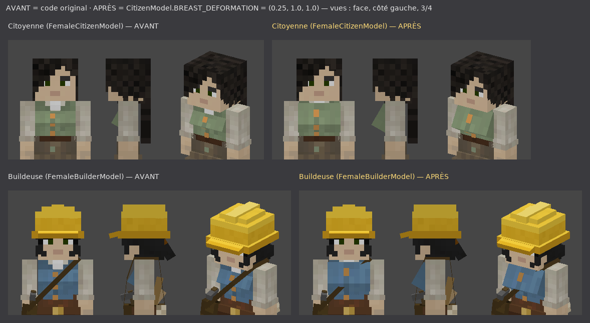
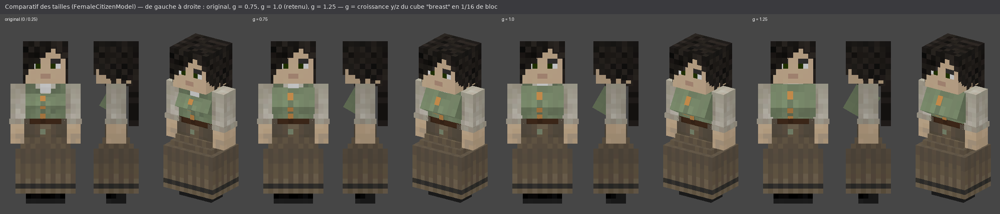
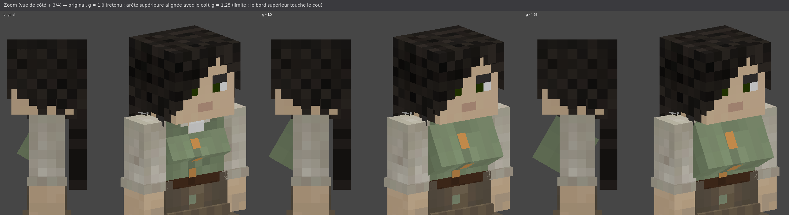

# Poitrine agrandie sur les modèles féminins — où et comment

> Deuxième modification « troll » du fork : toutes les citoyennes **adultes** de MineColonies
> (40 métiers, buildeuse comprise) ont désormais une poitrine nettement plus volumineuse.
> Aucune texture n'est modifiée, le modèle enfant n'est pas touché, et la taille se règle
> **sur une seule ligne**.



---

## 1. Résumé en 30 secondes

| | |
|---|---|
| **Quoi** | Le cube `"breast"` (la « poitrine ») de chaque modèle féminin adulte est gonflé. |
| **Comment** | Via un `CubeDeformation` (gonflement du cube en 1/16 de bloc), au lieu de `new CubeDeformation(0.0F)`. La texture 8×3×3 existante est simplement étirée sur le cube plus gros : **zéro texture à repeindre**. |
| **Où est le réglage** | `src/main/java/com/minecolonies/api/client/render/modeltype/CitizenModel.java` → constante `BREAST_DEFORMATION` (une ligne). |
| **Valeur retenue** | `new CubeDeformation(0.25F, 1.0F, 1.0F)` → la poitrine dépasse du torse de ≈ 3 px (au lieu de ≈ 1.5 px) et s'élargit de 0.25 px (0.5 px avec la 2e couche) de chaque côté. |
| **Fichiers touchés** | 1 constante dans `CitizenModel.java` + 40 fichiers `Female*Model.java` (2 lignes chacun) + le previewer Python. |
| **Non touché** | `FemaleChildModel` (enfants), tous les modèles masculins, les pillards (`*Raider*`), toutes les textures. |

---

## 2. Le réglage (la seule chose à connaître)

Dans `src/main/java/com/minecolonies/api/client/render/modeltype/CitizenModel.java` :

```java
/** Gonflement (x, y, z, en 1/16 de bloc) du cube "breast" de tous les modèles féminins adultes. */
public static final CubeDeformation BREAST_DEFORMATION = new CubeDeformation(0.25F, 1.0F, 1.0F);

/** Idem pour la 2e couche (le "vêtement", 0.25 plus épais) du même cube. */
public static final CubeDeformation BREAST_OVERLAY_DEFORMATION = BREAST_DEFORMATION.extend(0.25F);
```

Pour changer la taille, on ne modifie que les trois nombres de `BREAST_DEFORMATION` ;
la 2e couche suit automatiquement (`extend(0.25F)` ajoute 0.25 sur les trois axes).

| `BREAST_DEFORMATION` | Résultat | Remarque |
|---|---|---|
| `(0.0F, 0.0F, 0.0F)` | Original de MineColonies | = revenir à la normale |
| `(0.25F, 0.75F, 0.75F)` | Un peu plus gros | discret |
| **`(0.25F, 1.0F, 1.0F)`** | **Nettement plus gros — valeur retenue** | l'arête supérieure du cube reste alignée avec le col, en dessous du cou |
| `(0.5F, 1.25F, 1.25F)` | Encore plus gros | limite : le bord supérieur affleure la base du cou |
| au-delà | Le haut du cube remonte **au-dessus** du cou (y < 0 dans le repère du corps) | il faut alors aussi augmenter l'origine Y du cube (`1.8938F` dans les 40 modèles, voir § 4) |




Pourquoi `x` est plus petit que `y`/`z` : le cube fait déjà 8 px de large (toute la largeur du
torse). Gonfler en x l'élargit sous les bras, et au-delà de ≈ 0.5 il rentre visiblement dans
les bras. Ce sont `y` et `z` qui font « ressortir » la poitrine (voir § 4).

---

## 3. Ce qui a été modifié exactement

### 3.1 `CitizenModel.java` (classe mère de tous les modèles de citoyens)

`src/main/java/com/minecolonies/api/client/render/modeltype/CitizenModel.java` : ajout des deux
constantes ci-dessus (avec Javadoc en anglais, comme le reste du code). Tous les
`Female*Model` héritent de `CitizenModel`, donc ils y accèdent par leur simple nom, sans import.

### 3.2 Les 40 modèles féminins adultes (`src/main/java/com/minecolonies/core/client/model/`)

Dans chacun de ces fichiers, l'instruction qui crée la pièce `"breast"` ressemblait à :

```java
PartDefinition breast = bipedBody.addOrReplaceChild("breast", CubeListBuilder.create()
    .texOffs(64, 49).addBox(-3.0F, 1.8938F, -5.716F, 8.0F, 3.0F, 3.0F, new CubeDeformation(0.0F))
    .texOffs(64, 55).addBox(-3.0F, 1.8938F, -5.716F, 8.0F, 3.0F, 3.0F, new CubeDeformation(0.25F)),
    PartPose.offsetAndRotation(-1.0F, 3.0F, 4.0F, -0.5236F, 0.0F, 0.0F));
```

et devient :

```java
PartDefinition breast = bipedBody.addOrReplaceChild("breast", CubeListBuilder.create()
    .texOffs(64, 49).addBox(-3.0F, 1.8938F, -5.716F, 8.0F, 3.0F, 3.0F, BREAST_DEFORMATION)
    .texOffs(64, 55).addBox(-3.0F, 1.8938F, -5.716F, 8.0F, 3.0F, 3.0F, BREAST_OVERLAY_DEFORMATION),
    PartPose.offsetAndRotation(-1.0F, 3.0F, 4.0F, -0.5236F, 0.0F, 0.0F));
```

C'est **tout** : seules les deux `CubeDeformation` de cette instruction changent (2 lignes par
fichier) ; position, rotation, dimensions et coordonnées de texture sont inchangées. Le
remplacement a été fait par script (regex limitée à l'instruction `addOrReplaceChild("breast" … ;`)
puis vérifié : 40 fichiers sur 40 référencent les constantes, et plus aucune `new CubeDeformation(…)`
littérale ne subsiste dans ces instructions.

Les 40 fichiers :

`FemaleAlchemistModel` `FemaleApiaryModel` `FemaleArcherModel` `FemaleAristocratModel`
`FemaleBakerModel` `FemaleBlacksmithModel` `FemaleBuilderModel` `FemaleCarpenterModel`
`FemaleChickenHerderModel` `FemaleCitizenModel` `FemaleComposterModel` `FemaleConcreteMixerModel`
`FemaleCookModel` `FemaleCourierModel` `FemaleCowHerderModel` `FemaleCrafterModel`
`FemaleDruidModel` `FemaleDyerModel` `FemaleEnchanterModel` `FemaleFarmerModel`
`FemaleFisherModel` `FemaleFletcherModel` `FemaleFloristModel` `FemaleForesterModel`
`FemaleGlassblowerModel` `FemaleHealerModel` `FemaleKnightModel` `FemaleMechanistModel`
`FemaleMinerModel` `FemaleNetherWorkerModel` `FemaleNobleModle` *(sic, faute de frappe d'origine)*
`FemalePlanterModel` `FemaleRabbitHerderModel` `FemaleSettlerModel` `FemaleShepherdModel`
`FemaleSmelterModel` `FemaleStudentModel` `FemaleSwineHerderModel` `FemaleTeacherModel`
`FemaleUndertakerModel`

Particularités rencontrées (sans incidence, le remplacement ne touche que la déformation) :
`FemaleAlchemistModel` écrit l'instruction sur trois lignes ; `FemaleCourierModel` place le cube
à `y = 2.2938F` avec un pivot différent (`-9.0F`) parce que son corps est construit autrement ;
deux modèles utilisaient `0.249F` au lieu de `0.25F` pour la 2e couche ; `FemaleKnightModel`
cache la pièce `"breast"` quand la chevalière porte un plastron (`hasItemInSlot(EquipmentSlot.CHEST)`,
comportement d'origine, conservé).

### 3.3 Le previewer Python (`tools/model_preview/render_citizen_model.py`)

Pour pouvoir visualiser le résultat sans Minecraft, le rendu logiciel écrit pour la buildeuse
a été complété :

* `new CubeDeformation(gx, gy, gz)` (gonflement différent par axe) est maintenant interprété ;
* option `--constants-from <Fichier.java>` : résout les constantes `static final`
  (`String`, `float`, `CubeDeformation`, y compris `X.extend(g)`) déclarées dans un autre fichier,
  ici `CitizenModel.java`.

Exemple :

```bash
python3 tools/model_preview/render_citizen_model.py \
  --java src/main/java/com/minecolonies/core/client/model/FemaleCitizenModel.java \
  --constants-from src/main/java/com/minecolonies/api/client/render/modeltype/CitizenModel.java \
  --texture src/main/resources/assets/minecolonies/textures/entity/citizen/default/citizenfemale1_a.png \
  --out /tmp/citoyenne.png --views front,left,iso --scale 12
```

### 3.4 Documentation (`documentation/female_models_bust/`)

| Image | Contenu |
|---|---|
| `avant_apres.png` | Citoyenne et buildeuse, original vs modifié (face, côté, 3/4) |
| `autres_metiers.png` | Fermière, noble, cuisinière, chevalière : avant / après |
| `comparatif_tailles.png` | Original, g = 0.75, g = 1.0 (retenu), g = 1.25 côte à côte |
| `comparatif_tailles_zoom.png` | Zoom sur l'arête supérieure : pourquoi 1.0 et pas 1.25 |
| `planche_40_modeles.png` | Les 40 modèles modifiés, chacun avec sa propre texture |

---

## 4. Pourquoi cette méthode (et pas une autre)

Le cube `"breast"` est une boîte de **8 × 3 × 3 px**, positionnée sur le haut du torse et inclinée
de **−30°** autour de l'axe X (`-0.5236F` rad). À cause de cette inclinaison, l'axe local « Z » du
cube pointe vers l'avant *et* le haut, et l'axe « Y » vers le bas *et* l'avant ; gonfler le cube
en y/z l'allonge donc dans ces deux directions et c'est ce qui le fait ressortir du torse.

Chiffres (repère du corps, 1 unité = 1 px de texture) :

| | Original | Avec `(0.25, 1.0, 1.0)` |
|---|---|---|
| Arête supérieure avant | y ≈ 1.8, z ≈ −1.9 (**dans** le torse, dont la face avant est à −2 / −2.25 avec la veste) | y ≈ 0.4, z ≈ −2.3 (affleure la veste, toujours sous le cou qui est à y = 0) |
| Arête inférieure avant | z ≈ −3.4 | z ≈ −4.8 |
| Dépassement devant le torse | ≈ 1.4 px (1.65 avec la 2e couche) | ≈ 2.8 px (≈ 3.1 avec la 2e couche) |
| Largeur | 8 px | 8.5 px (9 px avec la 2e couche) |

Si on dépasse ≈ 1.25 en y/z, l'arête supérieure passe au-dessus de y = 0 et sort par le cou. Pour
aller plus gros il faut alors *aussi* descendre le cube : augmenter l'origine Y `1.8938F` dans les
`addBox` (≈ +0.8 par +0.5 de gonflement supplémentaire en y/z) — c'est volontairement resté hors de la constante pour
que le réglage par défaut tienne en une ligne.

Alternatives écartées :

* **`ModelPart.xScale / yScale / zScale`** (mise à l'échelle de la pièce à l'exécution) : la pièce
  est mise à l'échelle autour de son pivot, qui n'est pas au centre du cube ; le cube se déplace
  donc en même temps qu'il grossit et sort du torse par le haut. Il aurait fallu recalculer le
  pivot des 40 modèles.
* **Changer les dimensions du cube** (`8, 3, 3` → plus grand) : les coordonnées de texture
  (`texOffs(64, 49)`, zone 22 × 6 px) correspondent exactement à 8×3×3 ; un cube plus grand lirait
  des pixels voisins de la texture → il aurait fallu repeindre toutes les textures féminines
  (plus de 1 700 fichiers `*female*.png` dans `textures/entity/citizen/`, tous styles confondus). `CubeDeformation` conserve les UV et étire la texture :
  aucune retouche.

---

## 5. Vérifications effectuées

* **Compilation** : les 40 `Female*Model.java` modifiés ont été compilés avec le compilateur
  Eclipse (ECJ) contre des stubs minimaux des classes Minecraft/MineColonies dont ils dépendent
  (un vrai build Gradle n'est pas possible dans cet environnement sans accès aux dépôts Maven /
  NeoForge) : **0 erreur, 40 classes produites**. Test négatif : une faute volontaire dans un nom de
  constante est bien détectée (compilation en échec), la vérification est donc discriminante.
* **Rendu** : les 40 modèles rendus avec le previewer, chacun avec sa propre texture
  (`planche_40_modeles.png`) — aucun modèle cassé, l'arête supérieure du buste reste sous le cou
  sur tous.
* **Périmètre** : `git diff --stat` → 42 fichiers (1 `CitizenModel`, 40 modèles, 1 previewer) ;
  `FemaleChildModel.java` et les textures sont intacts (`git status` ne les liste pas).

Limites connues : seule la géométrie du cube est gonflée, donc un accessoire placé devant la
poitrine dans certains modèles (tablier, écharpe, bretelle de sac…) peut être partiellement
recouvert par le buste. Pour revenir à l'original sur **un seul** métier, il suffit de remettre
`new CubeDeformation(0.0F)` / `new CubeDeformation(0.25F)` dans son fichier.

---

## 6. Pour voir le résultat en jeu

Le rendu des citoyens est **côté client** : c'est le jar MineColonies du client qui affiche les
modèles. Il faut donc compiler ce fork (`./gradlew build` sur une machine avec accès internet, le
jar sort dans `build/libs/`) et le mettre dans le dossier `mods/` du client qui regarde / enregistre.
Pour la vidéo : si c'est toi qui filmes, ton client suffit ; si ton ami doit le voir sur son écran,
c'est son client qui doit avoir le jar modifié (même version de mod que le serveur, puisque seul le
rendu change).

Historique de cette modification : voir le commit « Female citizen models: bigger bust… » sur la
branche `arena/f86d8630-minecolo`. La première modification (buildeuse : casque de chantier,
ceinture à outils, rouleau de plans) est décrite dans `MODIFICATIONS_BUILDEUSE.md`.
